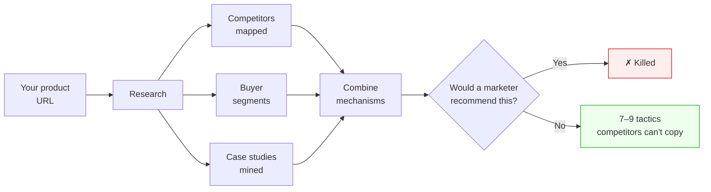

# Diffmode Growth Tactics

**Growth tactics for startups that can't outspend their competitors.** It researches your market, mines the *reasons* real growth plays worked from public case studies, combines them in ways nobody's tried, and kills anything a generic marketer would have suggested anyway.

Free. No account. Runs inside Claude Code or OpenAI Codex in about 90 minutes.




---

## What you get

- **A read on your competition.** Who you're up against, how each rival actually gets users, and the channels they're ignoring. That gap is where you get in.
- **A map of your buyers.** Real segments, the job each one hires you to do, and the moments that make someone switch.
- **7–9 unconventional tactics.** Each one a plain card: what it is, why your better-funded rivals can't copy it, how to start this week, and when to kill it.

Here's the kind of tactic a run produces:

> **The Hiring-Signal Pitch.** When a company posts a job to hire someone for the exact manual task your product removes, that's a buying signal nobody else is watching. Set alerts for those job titles. When one's posted, find the hiring manager and send a 60-second screen recording: "saw you're hiring a [role] to do [task] — here's my tool doing it live." A reply rate above ~10% means the angle lands.

Everything is yours to reuse — hand the competitor read to a freelancer, drop the buyer map into a deck. The run ends with a styled report in your browser.

---

## Why it's different

Most marketing tools hand you a checklist: do SEO, run ads, post on LinkedIn. Diffmode does the opposite.

**Mechanism, not tactic.** It stores *why* growth plays worked — not what channels were used. Mechanisms transfer across industries; channel checklists don't.

**Blind before analysis.** It picks which mechanisms to combine *before* it knows what tactic they'll produce. This stops the model from reverse-engineering its way back to the obvious answer.

**Rejection is the product.** Four separate gates throw away anything a generic marketer would recommend. Novelty isn't generated — it's what survives.

---

## Install

**Claude Code** — two commands, then restart:

```bash
claude plugin marketplace add acogood/diffmode_free
claude plugin install diffmode-growth-tactics@diffmode-free
```

Then from any folder:

```
/diffmode-growth-tactics:start your-product.com
```

No flags. Run it bare and it asks for your website. Run it again in the same folder and it resumes where it stopped.

**Codex** — clone this repo, then:

```bash
python3 codex/orchestrate.py --url https://your-product.com
```

Same pipeline, same quality gates. Full setup in [`codex/CODEX.md`](codex/CODEX.md).

---

## Requirements

- **[Claude Code](https://claude.com/claude-code)** or **[OpenAI Codex](https://developers.openai.com/codex)**. That's it.
- **Research backend:** the built-in web search, free, nothing to set up. A Perplexity MCP works too if you already have one (~$2–3 per run) — both are supported and validated; neither is the degraded option.
- **Model:** synthesis runs on Opus for reasoning quality; research and packaging use Sonnet.

---

## Free vs. the full Diffmode

This free tool builds the **strategy** — the competitor read, the buyer map, and the unconventional ideas. It stops at ideas.

[**Diffmode**](https://diffmode.app) picks up from there: it ranks the tactics so you know what to run first, and turns the top picks into a week-by-week rollout plan — drawn from a much deeper database of growth mechanisms. Start with a **free audit** (no credit card). The full plan comes with a **30-day money-back guarantee**.

→ **[diffmode.app](https://diffmode.app)**

---

## Under the hood

13 skill files hold the methodology. Four stateless workers execute them. An orchestrator owns the DAG, the retries, and the quality gates. Skills live once in `plugin/skills/`; Codex consumes them through symlinks. Full design in [`docs/architecture.md`](docs/architecture.md).

License: **[Apache-2.0](LICENSE)**. © 2026 Anton Kogut.
