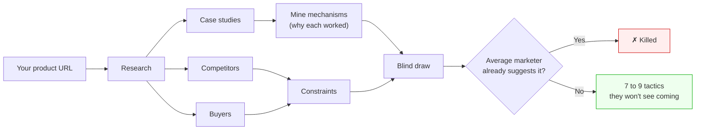

# Diffmode Growth Tactics

**Growth tactics for startups that can't outspend their competitors.** It researches your market, mines public case studies for the *reasons* real growth plays worked, combines them in ways nobody's tried, and kills anything an average marketer would have suggested anyway.

Free. No account. Runs inside Claude Code or OpenAI Codex in about 90 minutes.




---

## What you get

- **A read on your competition.** Who you're up against, how each rival gets users, and which channels they're ignoring. That gap is where you get in.
- **A map of your buyers.** Real segments, the job each one hires you to do, and what makes someone switch.
- **7 to 9 unconventional tactics.** Each one a plain card: what it is, why your competitors won't see it coming, how to start this week, and when to kill it.

Here's the kind of tactic a run produces:

> **The Hiring-Signal Pitch.** When a company posts a job to hire someone for the exact manual task your product removes, that's a buying signal nobody else is watching. Set alerts for those job titles. When one's posted, find the hiring manager and send a 60-second screen recording: "saw you're hiring a [role] to do [task]. Here's my tool doing it live." A reply rate above ~10% means the angle lands.

Everything is yours to reuse. Hand the competitor read to a freelancer, drop the buyer map into a deck. The run ends with a styled report in your browser.

---

## Why it's different

Ask any LLM to "give me a growth strategy" and you get back the averaged playbook from its training data. Diffmode never asks the model to invent tactics — it asks it to research, mine, combine, and reject. The inventing is done by the pipeline's structure.

**Mechanism, not tactic.** Each run mines 12–20 real case studies fresh, across industries, and distills each into *why* it worked — with sources, numbers, and failure modes kept. Clubhouse gave every user two invites and got a 10M-person waitlist and a $4B valuation on zero ad spend. The distilled mechanism: engineered scarcity turns users into recruiters competing for status — but it only buys time, because ~88% of them left the moment access opened. That failure mode stays in the record. It matters later.

**Blind before analysis.** Mechanisms are paired *before* anyone knows what tactic they'll produce, so the model can't reverse-engineer its way back to the obvious answer. Pair the Clubhouse mechanism with the one behind Glossier's Boy Brow — a bestseller sourced straight from a blog's comment section — and out comes *invites that carry a real vote on what gets built next*. Access expires; authorship doesn't. The combination explicitly closes Clubhouse's failure mode, and neither case suggests it alone. The order is enforced in the file, not just requested: the blind draw has to physically precede the analysis. Open `synthesis-explore.md` from your own run and check that the model didn't work backwards.

**Rejection is the product.** Some pairings are banned before the run even opens — combinations whose outcome stays conventional no matter what lands in them ("talk to customers, then write content"). Everything else meets four gates. The Marketer Test: would an average B2B marketer recommend this — yes, it dies. The Reframing Test: strip the adjectives, and if the core action is still conventional, it dies. Emergence Proof: if each mechanism could have produced it alone, nothing was synthesized — it dies. Anti-sameness: ten tactics can't all be "write content". Novelty isn't generated. It's what survives.

What's left becomes 7 to 9 tactics, each with a day-1 / day-7 / day-30 execution prototype and a "can a competitor copy this in 30 days?" check. A recent run: 24 mechanisms mined from 18 case studies, 18 blind pairs drawn, 8 tactics kept, 6 unconventional. At no point did the model answer the question "come up with tactics".

---

## Install

**Claude Code** (two commands, then restart):

```bash
claude plugin marketplace add acogood/diffmode_free
claude plugin install diffmode-growth-tactics@diffmode-free
```

Then from any folder:

```
/diffmode-growth-tactics:start your-product.com
```

No flags. Run it bare and it asks for your website. Run it again in the same folder and it resumes where it stopped.

**Codex** (clone this repo, then run):

```bash
python3 codex/orchestrate.py --url https://your-product.com
```

Same pipeline, same quality gates. Full setup in [`codex/CODEX.md`](codex/CODEX.md).

---

## Requirements

- **[Claude Code](https://claude.com/claude-code)** or **[OpenAI Codex](https://developers.openai.com/codex)**.
- **Research backend:** the built-in web search — free, nothing to set up, no API key. That's the whole requirement. If you'd rather spend ~$2-3 a run on your own Perplexity MCP, add the word `perplexity` to the command and it'll use that instead; otherwise it's never touched.
- **Model:** synthesis runs on Opus for reasoning quality; research and packaging use Sonnet.

---

## Free vs. the full Diffmode

This free tool builds the **strategy**: the competitor read, the buyer map, and the unconventional ideas. It stops at ideas.

[**Diffmode**](https://diffmode.app) picks up from there. It ranks the tactics so you know what to run first, and turns the top picks into a week-by-week rollout plan, drawn from a much deeper database of growth mechanisms. Start with a **free audit** (no credit card). The full plan comes with a **30-day money-back guarantee**.

→ **[diffmode.app](https://diffmode.app)**

---

## Under the hood

13 skill files hold the methodology. Four stateless workers execute them. An orchestrator owns the DAG, the retries, and the quality gates. Skills live once in `plugin/skills/`; Codex consumes them through symlinks. Full design in [`docs/architecture.md`](docs/architecture.md).

License: **[Apache-2.0](LICENSE)**. © 2026 Anton Kogut.
